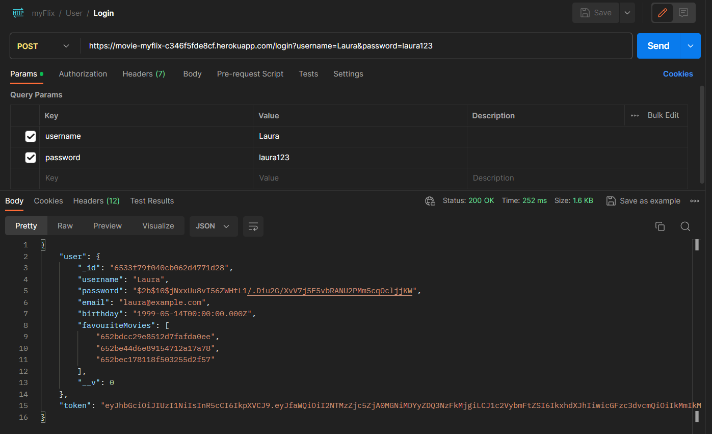

# The server-side component of myFlix

## Table of contents

-   [Introduction](#introduction)
-   [Screenshots to represent the project](#screenshots-to-represent-the-project)
-   [Tasks in the project](#tasks-in-the-project)
-   [Link to the App](#link-to-the-app)
-   [Technologies](#technologies)
-   [Dependencies](#dependencies)
-   [References](#references)

### Introduction

The aim of this project was to build the server-side component of a “myFlix” web application. The web application provide users with access to information about different movies, directors, and genres. Users are able to sign up, update their personal information, and create a list of their favorite movies.

### Screenshots to represent the project

### Tasks in the project

-   Created a server with Express.
-   Designed a REST API with CRUD functionality.
-   Created API documentation.
-   Conducted testing with Postman.
-   Established a NoSQL database using MongoDB.
-   Integrated the database with the API, implementing business logic.
-   Ensured security with CORS middleware, permitting access from specific domains.
-   Enhanced data security by hashing user passwords using bcrypt.
-   Implemented server-side input validation to prevent XSS and SQL injection.
-   Successfully deployed the API to an online hosting server.
-   Migrated the local database to a cloud-based hosting platform.

### Link to the App

A link to the live, hosted version of the app: [https://movieapi-myflix.onrender.com/](https://movieapi-myflix.onrender.com/)  
A link to the documentation of the app: [https://movieapi-myflix.onrender.com/documentations/documentation.html](https://movieapi-myflix.onrender.com/documentations/documentation.html)

### Technologies

The following technologies were used:

-   Node.js
-   MongoDB (with MongoDB Atlas)
-   Postman

### Dependencies

-   Express.js: Node.js web application framework
-   Mongoose: an Object Data Modeling (ODM) library for MongoDB and Node.js
-   Morgan: HTTP request logger middleware for Node.js
-   Body-Parser: Node.js body parsing middleware
-   Passport.js: authentication middleware for Node.js
-   Bcrypt: a library for hashing passwords, enhacing security to user's password data.
-   Cors: middleware enabling Cross-Origin Resource Sharing, allowing controlled access to resources on allowed domains.
-   JSONWebToken: an implementation of JSON Web Tokens, creates and verifies JSON Web Tokens, used for authentication and authorization.

### References

1.  Reference  
    Description: Render is a unified cloud to build and run apps and websites with free TLS certificates, global CDN, private networks and auto deploys from Git.  
    Product: Render  
    Date: 23/10/2023  
    [https://render.com/](https://render.com/)

2.  Reference  
    Description: MongoDB Atlas is a multi-cloud database service by the same team that build MongoDB. Atlas simplifies deploying and managing databases while offering the versatility to build resilient and performant global applications on the cloud providers of choice.  
    Product: MongoDB Atlas  
    Date: 23/10/2023  
    [https://www.mongodb.com/cloud/atlas/register](https://www.mongodb.com/cloud/atlas/register)
